<div align="center">

# 🐾 LegacyPet

**Your repo has a pet. Don't let it become a zombie.**

A pixel pet that lives in your README and feels exactly how your project is doing:
fed by commits, healed by green CI, cheered up when issues get answered.

[](https://github.com/Tanx-1811/legacypet/actions/workflows/ci.yml)


[English](README.md) · [Tiếng Việt](README.vi.md) · **[🔮 Preview your repo's pet](https://tanx-1811.github.io/legacypet/)**


</div>

## Why

Everyone who lands on your repo asks the same question: **is this project alive?**
Stars don't answer it. Commit graphs take effort to read. A pet answers it in one glance,
and gives you a small, silly reason to come back and care for your code.

- 🍖 **Commits feed it.** Stop pushing and it gets hungry. Six months later it rises from the grave.
- ❤️ **CI keeps it healthy.** A red build gives it a fever and an ice pack.
- 😊 **Issues make it happy or sad.** Leave people unanswered and a rain cloud follows it around.
- 🎉 **Releases throw a party.** Confetti, a party hat, and a shout-out to your contributors.
- 📔 **It keeps a diary** of every day of your project's life.
- 🩺 **It gives you a checkup**: what's wrong, and exactly what would help.
- 🏞️ **All your pets meet in a Pet Park** on your profile README.

Everything runs inside a GitHub Action: no server, no sign-up, no tracking, zero dependencies.

## Quick start

### 1. Preview it (optional)

Open the **[playground](https://tanx-1811.github.io/legacypet/)**, type any `owner/repo`
and see which pet it hatches, plus a checkup. Then share the link and show off. 🔮

### 2. Adopt it with one command

Inside your repository:

```sh
npx github:Tanx-1811/legacypet init
```

This adds `.github/workflows/legacypet.yml`, puts the pet at the top of your `README.md`
and shows a preview right in your terminal. Then:

```sh
git add . && git commit -m "Adopt a LegacyPet 🐾" && git push
```

Run the workflow once from the **Actions** tab (or wait for the schedule) and refresh your README. Hello, pet!

Options: `--lang vi`, `--species cactus`, `--name Mochi`, `--style badge`. In a profile repo (`you/you`) it sets up a [Pet Park](#pet-park) instead.

### …or by hand

Add [`.github/workflows/legacypet.yml`](examples/legacypet.yml):

```yaml
name: LegacyPet
on:
  schedule:
    - cron: '17 */6 * * *'
  release:
    types: [published]
  workflow_dispatch:

permissions:
  contents: write # publish the pet to the `legacypet` branch
  actions: write # keep the schedule alive while the repo sleeps
  issues: read
  pull-requests: read
  checks: read
  statuses: read

jobs:
  legacypet:
    runs-on: ubuntu-latest
    steps:
      - uses: Tanx-1811/legacypet@v1
```

Run it once from the **Actions** tab, then paste this into your README (replace `OWNER/REPO`):

```md
[](https://github.com/OWNER/REPO/blob/legacypet/DIARY.md)
```

The action also prints the exact snippet in its job summary.
Your pet lives on its own `legacypet` branch, so your main history stays clean.

### Pick a size

| File | Looks like | Best for |
| --- | --- | --- |
| `pet.svg` | the card above | the top of a project README |
| `pet-mini.svg` |  | sidebars, tables, profile READMEs |
| `pet-badge.svg` |  | next to your other badges |
| `park.svg` | see [Pet Park](#pet-park) | your profile README |

Swap the file name in the snippet to switch.

## Moods

<table>
<tr>
<td align="center"><br><b>Ecstatic</b></td>
<td align="center"><br><b>Happy</b></td>
<td align="center"><br><b>Party</b></td>
<td align="center"><br><b>Hungry</b></td>
<td align="center"><br><b>Sleepy</b></td>
</tr>
<tr>
<td align="center"><br><b>Sad</b></td>
<td align="center"><br><b>Sick</b></td>
<td align="center"><br><b>Zombie</b></td>
<td align="center"><br><b>Hibernating</b></td>
<td align="center"><br><b>Egg</b></td>
</tr>
</table>

The first mood that applies wins:

| Mood | When |
| --- | --- |
| 💤 Hibernating | The repo is archived. It sleeps peacefully under the snow. |
| 🥚 Egg | Fewer than 5 commits. It cracks a little more with each one. |
| 🧟 Zombie | 180 days without a commit. Flies, a tombstone, and a craving for commits. |
| 🥳 Party | It just hatched, came back from the dead, you shipped a release in the last 3 days, or it's the repo's birthday, New Year, Tết or Programmers' Day. |
| 🤒 Sick | CI is failing on the default branch. |
| 🍖 Hungry | About 25 days without a commit. |
| 🥺 Sad | Issues and PRs are going stale or unanswered. |
| 😴 Sleepy | No commits in the last two weeks. |
| 🤩 Ecstatic | All vitals average 80 or more. |
| 😊 Happy | Everything else. Life is good. |

### Vitals

Every number on the card maps to a real maintenance habit:

| Vital | Measures | Formula |
| --- | --- | --- |
| 🍖 Fullness | Time since the last commit | `100 · e^(−days / 21)`, so 72 after a week and 24 after a month |
| ❤️ Health | CI on the latest default-branch commit | 100 when passing, 85 while running, 70 with no CI, low when failing |
| 😊 Joy | Care for issues and PRs | Drops with the share of stale items and each community issue waiting 7+ days for a first reply |
| ⚡ Energy | Commits in the last 14 days | `100 · (1 − e^(−commits / 6))` |
| 🧼 Hygiene | README, license, code of conduct… | GitHub's community profile score |

Issues opened by maintainers don't count as "unanswered", and bots never earn treats.
The pet only judges you on what visitors would care about.

## Species

Your repo picks its own pet. Rust repos always hatch a crab and Python repos a snake.
Everyone else gets one decided by the repo's name. Each species bends one rule:

| | Species | Trait | Effect |
| :-: | --- | --- | --- |
|  | Slime | Adaptable | No strengths, no weaknesses. Perfectly balanced. |
|  | Cat | Independent | Ignored issues hurt its joy only half as much. |
|  | Rubber Duck | Debugger | Helps you debug, so failing CI hurts it 35% less. |
|  | Crab | Molting | Grows a new shell with every release: +15 joy for two weeks. |
|  | Octopus | Multitasker | Eight arms love company: +6 energy per extra active contributor. |
|  | Snake | Patient | Eats rarely, so hunger builds 40% slower. |
|  | Cactus | Drought-proof | Thrives on neglect: hunger builds 4× slower. Made for finished projects. |

Prefer a different one? Set `species: cactus`. Want a name? Set `name: Mochi`.
Otherwise the repo names its pet too. You don't choose, you adopt.

### ✨ Shiny pets

One repo in 64 hatches a **shiny** pet with different colors and a sparkle. There is no way to reroll.

      

## Growing up

   

**Egg** (under 5 commits) → **Baby** with a sprout (under 50 commits or a month old) → **Adult** → **Elder** with a monocle (3 years and 300+ commits).
The level is `√(all-time commits) + 1`, so Lv.11 at 100 commits and Lv.32 at 1,000.

## Trophies

Trophies are permanent. Once earned, they stay on the card even if the streak breaks.

| | Trophy | How |
| :-: | --- | --- |
| 🐣 | Hatched | Grow out of the egg |
| 🧟 | Back from the Dead | Feed a zombie |
| 🩹 | Survivor | Fix a failing CI |
| ✨ | Shiny! | Be one in 64 |
| 🔥 | On Fire | 7-day commit streak |
| ☄️ | Comet | 30-day commit streak |
| 💯 | Centurion | 100 commits |
| 🚀 | Shipper | Publish a release |
| ⭐ | Rising Star | 100 stars |
| 🌟 | Superstar | 1,000 stars (comes with a crown) |
| 🤝 | Squad | 10 contributors |
| 🧼 | Spotless | 100% community profile |
| 📭 | Inbox Zero | No open issues or PRs |
| 🧙 | Wise Elder | Reach the elder stage |

## Seasons, holidays and night mode

The scene follows the calendar: petals in spring, fireflies in summer, falling leaves in autumn, snow in winter.
In dark mode it's night, with a moon and twinkling stars.

    

Halloween brings a witch hat and a pumpkin, Christmas a Santa hat, and New Year fireworks.
Tết (Lunar New Year) brings red lanterns, and the 256th day of the year is Programmers' Day.

## It talks about your repo

The speech bubble isn't random filler. It reads the room:

> "My tummy hurts... "test (ubuntu-latest)" is failing 🤒"
> "Psst... issue #12 has waited 87 days for a reply"
> "@octocat fed me a treat (#42) 🍪"
> "v2.0.0 just shipped! Party time! 🎉"
> "Last fed 420 days ago. I have seen things."

It speaks English and Vietnamese (`lang: vi`). [More languages welcome!](CONTRIBUTING.md#translate)

## The diary

Click the pet and you land on `DIARY.md`, one line per day of your project's life:

```md
- **2026-10-08** · Day 812 · 🤩 ecstatic · ate 4 commits · got a treat from @octocat (#42) · unlocked 🔥 On Fire · "Best. Maintainer. Ever. 💖"
- **2026-10-07** · Day 811 · 😊 happy · ate 2 commits · "Nom nom, thanks for the commits!"
```

## Checkup

Every run ends with a plain-language checkup in the job summary (also in the CLI and the playground):
why your pet feels the way it does, and what would help.

```text
✔ ❤️ CI is green on the default branch.
! 💬 3 community issues are waiting for a first reply. The oldest is #12 (87 days).
! 🕸️ 19 issues or PRs have been untouched for 30+ days. Triage or close them.
· 🧼 Community profile is at 62%. Add the missing README, license, CONTRIBUTING or code of conduct.
```

## Pet Park

Put **every pet you own in one meadow** on your profile README. The park shows which projects are thriving
and which ones need you.


In your profile repo (`you/you`), run `npx github:Tanx-1811/legacypet init`, or add `park` to the workflow:

```yaml
      - uses: Tanx-1811/legacypet@v1
        with:
          park: auto # your top 6 repos by stars; or a list: "app, dotfiles, other-owner/lib"
```

and show it with:

```md
[](https://github.com/YOU)
```

Repos that already have their own LegacyPet keep its name, species and trophies in the park.
The default token can read your public repos. To include private ones, pass a personal access token as `github-token`.

## Configuration

| Input | Default | Description |
| --- | --- | --- |
| `species` | `auto` | `auto`, `blob`, `cat`, `duck`, `crab`, `octopus`, `snake`, `cactus` |
| `name` | | Custom name. Empty means the repo names it. |
| `lang` | `en` | `en` or `vi` |
| `theme` | `auto` | `auto` follows the viewer's light/dark mode. Also `light` or `dark`. |
| `branch` | `legacypet` | Where the pet lives. Rewritten on every run, so use a dedicated branch. |
| `diary` | `true` | Keep `DIARY.md` |
| `park` | | Also draw `park.svg`: `auto` or a list of repos |
| `park-size` | `6` | How many repos `auto` puts in the park (1–8) |
| `ignore-checks` | | Comma-separated check names that shouldn't affect health |
| `keepalive` | `true` | Stop GitHub from pausing the schedule after 60 quiet days (needs `actions: write`) |
| `dry-run` | `false` | Render without publishing |
| `repository` | current repo | Visit another repo's pet |
| `github-token` | `github.token` | Token used for the API |

**Outputs:** `mood`, `name`, `level`, `species`, `stage`, `speech`, `svg-path`. For example, ping your team when the pet gets sick:

```yaml
      - uses: Tanx-1811/legacypet@v1
        id: pet
      - if: steps.pet.outputs.mood == 'sick'
        run: echo "${{ steps.pet.outputs.name }} is sick! ${{ steps.pet.outputs.speech }}"
```

The branch also holds `pet.json`, the pet's full state, if you want to build something on top.

## CLI

No install needed. It works on any public repo:

```sh
npx github:Tanx-1811/legacypet init                       # adopt a pet in the current repo
npx github:Tanx-1811/legacypet render vercel/next.js      # draw any repo's pet + checkup
npx github:Tanx-1811/legacypet park sindresorhus          # draw someone's Pet Park
npx github:Tanx-1811/legacypet demo --mood zombie --species cat --lang vi
```

In a terminal with true color, it draws the pet right in your shell.

## FAQ

**Will it spam my commit history?** No. The pet lives on its own branch, which is replaced by a single commit on every run.

**Private repos?** Yes. Use `https://github.com/OWNER/REPO/blob/legacypet/pet.svg?raw=true` as the image URL so GitHub serves it to people who have access.

**Why does it need `actions: write`?** GitHub pauses scheduled workflows in repos with no activity for 60 days. That would freeze a neglected pet before it ever turns into a zombie. LegacyPet re-enables its own workflow on each run. Remove the permission and set `keepalive: false` if you'd rather not.

**Does it send my data anywhere?** No. It reads the GitHub API with your workflow's token and writes to your repo. That's all.

**Is it accessible?** Every SVG has a title and a full text description for screen readers, and all animation stops when the viewer prefers reduced motion.

## Contributing

The best first contribution is a **new species**: a 16×16 grid of letters, a palette and a trait.
It takes about ten minutes, and `npm run gallery` shows it in every mood right away. See [CONTRIBUTING.md](CONTRIBUTING.md).

The playground runs the exact same code in the browser: `npm run playground` and open http://localhost:4173.

Ideas on the roadmap:

- 🌍 More languages (each one is a single file)
- 💬 A `/pet` command in issues, so the pet answers in the thread
- 🐉 Rare evolutions (a duck that becomes a phoenix after 1,000 days without a red build?)
- 🤝 **Visits**: pets of repos that depend on each other say hi

## License

[MIT](LICENSE). Adopt freely.
