# 🐣 Kobbo the Feverish

🤒 Lv.12 Baby Slime, sick.

**Mood, last 3 days:** 🥳🥳🤒

This branch is rewritten on every run by [LegacyPet](https://github.com/Tanx-1811/legacypet). Please don't edit it by hand.

| File | What it is | Markdown |
| --- | --- | --- |
| `pet.svg` | The full card | `` |
| `pet-mini.svg` | A compact card for profiles and sidebars | `` |
| `pet-badge.svg` | A badge for the top of your README | `` |
| `pet-stats.svg` | Vitals and moods over the last 30 days | `` |
| `pet-shields.json` | A [shields.io endpoint](https://shields.io/badges/endpoint-badge) | `` |
| `pet.json` | The pet's memory: vitals, trophies and mood history | |
| `DIARY.md` | One diary entry per day | |
