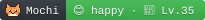
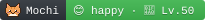
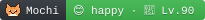

<div align="center">


# LegacyPet

**Your repo has a pet. Don't let it become a zombie.**

A pixel pet that lives in your README and feels exactly how your project is doing:
fed by commits, healed by green CI, cheered up when issues get answered.

[](https://github.com/Tanx-1811/legacypet/blob/legacypet/DIARY.md)
[](https://github.com/Tanx-1811/legacypet/actions/workflows/ci.yml)


[English](README.md) · [Tiếng Việt](README.vi.md) · **[🔮 Preview your repo's pet](https://tanx-1811.github.io/legacypet/)**


**🆕 New in 1.3:** [a desktop app](#️-the-desktop-app) · [weekly quests](#-weekly-quests) · [evolution](#-evolution) · [wardrobe](#-wardrobe) · [`/pet feed` and `/pet play`](#talk-to-your-pet-pet) · [a playground you can raise a pet in](#️-the-playground) · [full changelog](CHANGELOG.md)

</div>

## Why

Everyone who lands on your repo asks the same question: **is this project alive?**
Stars don't answer it. Commit graphs take effort to read. A pet answers it in one glance,
and gives you a small, silly reason to come back and care for your code.

- 🍖 **Commits feed it.** Stop pushing and it gets hungry. Six months later it rises from the grave.
- ❤️ **CI keeps it healthy.** A red build gives it a fever and an ice pack.
- 😊 **Issues make it happy or sad.** Leave people unanswered and a rain cloud follows it around.
- 🎉 **Releases throw a party.** Confetti, a party hat, and a shout-out to your contributors.
- 📔 **It keeps a diary** of every day of your project's life.
- 🩺 **It gives you a checkup**: what's wrong, and exactly what would help.
- 💬 **It talks back.** Comment `/pet` on an issue or PR and it answers, in 7 languages.
- 🦸 **43 species to adopt**, from a rubber duck to a ninja fox, a kappa and a mimic, each living in its own animated home.
- 🏞️ **All your pets meet in a Pet Park** on your profile README.

Everything runs inside a GitHub Action: no server, no sign-up, no tracking, zero dependencies.

## Quick start

### 🖥️ The desktop app

**Every project on your computer gets a pet.** [Download LegacyPet](https://tanx-1811.github.io/legacypet/#/get)
for macOS, Windows or Linux, open it and press **Allow & find my projects**. That's all:

- It finds the git repos in the folders you pick (GitHub Desktop's `Documents/GitHub` is ticked for you)
  and gives each one a pet at once, offline, from your own commits.
- **🏡 Adopt on GitHub** moves a pet into the repo's README with one click: it adds the two files,
  commits only those and pushes with your own Git. **Adopt them all** does every repo in one go.
- A pet sits on your desktop, the menu bar shows who needs care, and a notification tells you when a pet
  gets hungry or sick, levels up or earns a trophy.
- A dashboard for all of them: a year of commits on one activity calendar, the busiest repos this week,
  and the streaks that end tonight without a commit (with an evening reminder).
- Press **⌘K** (**Ctrl+K**) to jump to any project, page or action, and open a project in VS Code, Cursor,
  Zed or a terminal straight from its page. In the desktop app, **⌘⇧L** (**Ctrl+Shift+L**) brings it up from anywhere.
- Feed, play and pat every pet once a day (or all of them at once), dress it up, or raise it in the simulator.
- **Make it yours** on each pet's *Customize* tab: name (or roll a random one), species, a coat color,
  a catchphrase, its home, the card theme and its wardrobe, with a live preview. *Update on GitHub* takes it all along.
- Handy extras on each pet's page: download the card, mini card or badge (SVG or PNG), copy the README snippet,
  keep notes for the project, and `git fetch` / `git pull --ff-only` without leaving the app.
- Pick which news notifies you, when the streak reminder comes, and quiet hours. Size the desktop pet and
  let it speak up or stay quiet. A backup file carries your settings, notes and every pet's memory to another computer.

**Private by design.** No account, no tracking. It reads only the folders you allow, writes only when you
press adopt, and talks to GitHub only when you turn on *GitHub details* (CI, issues and stars), with your
GitHub CLI login or a token. Everything it remembers lives in `~/.legacypet`, and *Settings* erases it in one click.

Have Node.js? Skip the download:

```sh
npx github:Tanx-1811/legacypet app
```

It opens the same app in its own window (Chrome or Edge) and quits when you close it.

> [!NOTE]
> The app isn't signed by Apple or Microsoft yet. On macOS, the first launch may say it can't be opened:
> go to **System Settings → Privacy & Security** and press **Open Anyway**. On Windows, press
> **More info → Run anyway** on the SmartScreen prompt.

### ⌨️ In your terminal

Your pet can live where you code, too. Inside a repo:

```sh
npx github:Tanx-1811/legacypet hooks install
```

From then on it pops up right in your terminal, animated, whenever git does something:

- **Commit**, and it eats the commit. Each kind tastes different: a `feat:` is cake 🍰, a `fix:` an apple 🍎,
  `test:` broccoli 🥦, `docs:` a fortune cookie 🥠, `refactor:` an onigiri 🍙 and a merge a whole bento 🍱
  (Conventional Commits, gitmoji or plain words, in English or Vietnamese). Then it shows the XP it got, your streak
  and how far the next level is, and throws a party with confetti when it levels up, ranks up, hatches or comes back
  from the dead. It notices the first commit of the day, round numbers (commit #100!), streak milestones and late nights too.
- **Push**, and your commits take off in a rocket 🚀 (a tag gets confetti).
- **Pull**, and your team's commits rain down as gifts 📦, with who sent them.
- **Switch branches**, and it walks over to a signpost with the branch's name 🌿.

It's the same pet as in the app and the README, doing its own signature move, wearing its own hat. A reaction takes about
two seconds and can never fail a commit or a push. Your own hooks keep running (a team's hooks in `core.hooksPath`, like
husky's, are left alone unless you pass `--force`), rebases and bisects stay quiet, and an editor's commit button just
gets one line. `legacypet hooks remove` takes it all out again; `--all` does every repo the app found.

Two more ways to meet it in a terminal:

```sh
legacypet live    # a companion for a split pane while you code
legacypet hi      # the pet waves and shows how the repo is doing
```

`live` keeps the pet on screen: it idles, blinks, hums a tune and shows off its move, reacts the moment you commit, pull,
push or switch branches, nudges you when a lot of work hasn't been committed, and falls asleep when you stop.
Keys: **f** feed, **p** play, **space** pat, **t** a focus timer (25 minutes, or `--focus 50`), **q** quit.

Environment variables: `LEGACYPET_QUIET=1` silences one command, `LEGACYPET_HOOK=line` (just a line), `still`
(no animation) or `off`, and `LEGACYPET_SIZE=big` draws the pet twice as big. No repo at hand?
`legacypet react commit --demo --species ninja --level-up` plays a reaction with a made-up pet.

### 1. Adopt it in one click (nothing to install)

Open the **[playground](https://tanx-1811.github.io/legacypet/)**, type your `owner/repo`
and see which pet it hatches, plus a checkup. Like it? Press **🐣 Adopt on GitHub**:
GitHub opens with the workflow already filled in. Press **Commit changes** and your pet
hatches by itself within a minute. Then paste the README snippet the page gives you. Done!

### 2. …or with one command

Inside your repository:

```sh
npx github:Tanx-1811/legacypet init
```

This adds `.github/workflows/legacypet.yml`, puts the pet at the top of your `README.md`
and shows a preview right in your terminal. Then:

```sh
git add . && git commit -m "Adopt a LegacyPet 🐣" && git push
```

The pet hatches by itself a minute after the push. Refresh your README. Hello, pet!

Options: `--lang ja`, `--species ninja`, `--scenery beach`, `--name Mochi`, `--style badge`. In a profile repo (`you/you`) it sets up a [Pet Park](#pet-park) instead.

### …or by hand

Add [`.github/workflows/legacypet.yml`](examples/legacypet.yml):

```yaml
name: LegacyPet
on:
  schedule:
    - cron: '17 */6 * * *'
  release:
    types: [published]
  push:
    paths: ['.github/workflows/legacypet.yml'] # hatch right after you commit this file
  workflow_dispatch:
  issue_comment:
    types: [created] # talk to your pet with /pet

permissions:
  contents: write # publish the pet to the `legacypet` branch
  actions: write # keep the schedule alive while the repo sleeps
  issues: write # answer /pet in issues
  pull-requests: write # ...and in pull requests
  checks: read
  statuses: read

jobs:
  legacypet:
    if: github.event_name != 'issue_comment' || startsWith(github.event.comment.body, '/pet')
    runs-on: ubuntu-latest
    steps:
      - uses: Tanx-1811/legacypet@v1
```

Commit it and the pet hatches by itself. Then paste this into your README (replace `OWNER/REPO`):

```md
[](https://github.com/OWNER/REPO/blob/legacypet/DIARY.md)
```

The action also prints the exact snippet in its job summary.
Your pet lives on its own `legacypet` branch, so your main history stays clean.

### Pick a size

| File | Looks like | Best for |
| --- | --- | --- |
| `pet.svg` | the card above | the top of a project README |
| `pet-mini.svg` |  | sidebars, tables, profile READMEs |
| `pet-badge.svg` |  | next to your other badges |
| `park.svg` | see [Pet Park](#pet-park) | your profile README |
| `pet-shields.json` | a [shields.io endpoint](https://shields.io/badges/endpoint-badge) | a badge row in shields.io style |

Swap the file name in the snippet to switch. The shields.io badge looks like this:

```md

```

## Moods

<table>
<tr>
<td align="center"><br><b>Ecstatic</b></td>
<td align="center"><br><b>Happy</b></td>
<td align="center"><br><b>Party</b></td>
<td align="center"><br><b>Hungry</b></td>
<td align="center"><br><b>Sleepy</b></td>
</tr>
<tr>
<td align="center"><br><b>Sad</b></td>
<td align="center"><br><b>Sick</b></td>
<td align="center"><br><b>Zombie</b></td>
<td align="center"><br><b>Hibernating</b></td>
<td align="center"><br><b>Egg</b></td>
</tr>
</table>

The first mood that applies wins:

| Mood | When |
| --- | --- |
| 💤 Hibernating | The repo is archived. It sleeps peacefully under the snow. |
| 🥚 Egg | Fewer than 5 commits. It cracks a little more with each one. |
| 🧟 Zombie | 180 days without a commit. Flies, a tombstone, and a craving for commits. |
| 🥳 Party | It just hatched, came back from the dead, you shipped a release in the last 3 days, or it's the repo's birthday, New Year, Tết or Programmers' Day. |
| 🤒 Sick | CI is failing on the default branch. |
| 🍖 Hungry | About 25 days without a commit. |
| 🥺 Sad | Issues and PRs are going stale or unanswered. |
| 😴 Sleepy | No commits in the last two weeks. |
| 🤩 Ecstatic | All vitals average 80 or more. |
| 😊 Happy | Everything else. Life is good. |

### Vitals

Every number on the card maps to a real maintenance habit:

| Vital | Measures | Formula |
| --- | --- | --- |
| 🍖 Fullness | Time since the last commit | `100 · e^(−days / 21)`, so 72 after a week and 24 after a month |
| ❤️ Health | CI on the latest default-branch commit | 100 when passing, 85 while running, 70 with no CI, low when failing |
| 😊 Joy | Care for issues and PRs | Drops with the share of stale items and each community issue waiting 7+ days for a first reply |
| ⚡ Energy | Commits in the last 14 days | `100 · (1 − e^(−commits / 6))` |
| 🧼 Hygiene | README, license, code of conduct… | GitHub's community profile score |

Issues opened by maintainers don't count as "unanswered", and bots never earn treats.
The pet only judges you on what visitors would care about.

## Species

Your repo picks its own pet. Rust repos always hatch a crab and Python repos a snake.
Everyone else gets one decided by the repo's name. Each species bends one rule:

| | Species | Trait | Effect |
| :-: | --- | --- | --- |
|  | Slime | Adaptable | No strengths, no weaknesses. Perfectly balanced. |
|  | Cat | Independent | Ignored issues hurt its joy only half as much. |
|  | Rubber Duck | Debugger | Helps you debug, so failing CI hurts it 35% less. |
|  | Crab | Molting | Grows a new shell with every release: +15 joy for two weeks. |
|  | Octopus | Multitasker | Eight arms love company: +6 energy per extra active contributor. |
|  | Snake | Patient | Eats rarely, so hunger builds 40% slower. |
|  | Cactus | Drought-proof | Thrives on neglect: hunger builds 4× slower. Made for finished projects. |

### 🦸 The hero squad

Six original characters inspired by anime and Saturday-morning superhero cartoons. Each one brings a brand-new rule:

| | Species | Trait | Effect |
| :-: | --- | --- | --- |
|  | Ninja Fox (`ninja`) | Shadow Clone | Every day of your commit streak sends out a clone: +4 energy per day (up to +24). |
|  | Mecha (`mecha`) | Reactor Core | Green CI powers the reactor: energy never drops below 40 while CI passes. |
|  | Spirit Dragon (`dragon`) | Ancient Power | Has lived for millennia, so it levels up 50% faster. |
|  | Magical Bunny (`bunny`) | Starlight | Wishes on your stars: +2 joy per 100 stars (up to +20). |
|  | Night Guardian (`bat`) | Vigilant | Patrols the issue tracker: +15 joy while no community issue waits for a reply. |
|  | Super Pup (`hero`) | Steel Body | Shrugs off red builds: failing CI can't push its health below 40. |

They have their own catchphrases too ("Up, up and deploy! 🦸", "*poof* Shadow clone commit jutsu! 🍥").

### 🏮 The anime crew

Thirty more original characters, from Japanese folklore (kappa, tengu, kitsune, daruma, yurei) to anime and
fantasy archetypes (the idol, the isekai knight, the mini kaiju, the mimic). Each bends its own rule and has its own catchphrases:

| | Species | Trait | Effect |
| :-: | --- | --- | --- |
|  | Ronin Shiba (`samurai`) | Bushido | Trains every day: +12 energy on any day with a commit. |
|  | Nine-Tailed Fox (`kitsune`) | Nine Tails | Grows a tail every century, so it levels up 30% faster. |
|  | Leaf Tanuki (`tanuki`) | Festival Spirit | The more the merrier: +5 joy per extra active contributor (up to +20). |
|  | Little Oni (`oni`) | Iron Club | Brute strength: energy never drops below 35. |
|  | Kappa (`kappa`) | Cucumber Stash | Keeps snacks in its shell, so hunger builds 30% slower. |
|  | Crow Tengu (`tengu`) | Wind Rider | Rides the mountain wind: every commit gives 25% more energy. |
|  | Dream Eater (`baku`) | Sweet Dreams | Snacks on bad dreams: energy never drops below 30. |
|  | Lucky Cat (`maneki`) | Good Fortune | Beckons luck: +3 joy per 100 stars (up to +20). |
|  | Daruma (`daruma`) | Rise Again | Fall seven times, stand up eight: failing CI can't push its health below 45. |
|  | Forest Spirit (`kodama`) | Old Growth | An old repo is a sacred forest: +2 joy per year of age (up to +12). |
|  | Yurei (`ghost`) | Ethereal | Floats through walls: ignored issues hurt its joy 40% less. |
|  | Star Idol (`idol`) | Stage Smile | Always on stage: joy never drops below 35. |
|  | Little Witch (`witch`) | Grimoire | A tidy repo is a good spellbook: +12 joy while the community profile is 80% or more. |
|  | Isekai Knight (`knight`) | Gatekeeper | Guards the gate: +12 joy while no pull request has gone stale. |
|  | Stone Golem (`golem`) | Stone Heart | Hardly needs food: hunger builds 60% slower. |
|  | Phoenix Chick (`phoenix`) | Rebirth | Every release rekindles its flame: +20 energy for two weeks. |
|  | Monk Panda (`panda`) | Daily Practice | +3 joy per day of your commit streak (up to +18). |
|  | Mini Kaiju (`kaiju`) | Titan | Grows into a giant: levels up 40% faster. |
|  | Shark Pup (`shark`) | Always Swimming | Never stops: +3 energy per day of your commit streak (up to +18). |
|  | Ice Penguin (`penguin`) | Huddle | Penguins huddle: +5 energy per extra active contributor. |
|  | Axolotl (`axolotl`) | Regeneration | Regrows what it loses: failing CI hurts it 40% less. |
|  | Frog Prince (`frog`) | Morning Croak | A croak every morning: +10 energy on any day with a commit. |
|  | Owl Sage (`owl`) | Messenger | Delivers every letter: +12 joy while no community issue waits for a reply. |
|  | Monkey King (`monkey`) | Immortal Peach | Ate a peach of immortality: failing CI can't push its health below 35. |
|  | Space Cadet (`alien`) | Mothership | The mothership beams energy down: energy never drops below 45 while CI passes. |
|  | Little Vampire (`vampire`) | Undying | Failing CI hurts it only half as much. |
|  | Thunder Pup (`raiju`) | Static Charge | Every commit charges it up: commits give 50% more energy. |
|  | Captain Otter (`pirate`) | Crew | A captain loves a crew: +4 joy per extra active contributor (up to +20). |
|  | Sakura Sprite (`sakura`) | In Bloom | Each release brings blossoms: +12 joy for two weeks. |
|  | Mimic (`mimic`) | Treasure Chest | Every release fills its chest: +20 joy for two weeks. |

Pets that already hatched keep their species when new ones join the pool.

### 🕺 Signature moves

On good days (happy, ecstatic or partying) every species shows off its own move every few seconds,
on top of its mood animation. It stops when the pet feels bad, and with reduced motion.

| Species | Move | | Species | Move |
| --- | --- | --- | --- | --- |
| Slime | squashes flat and springs up | | Ninja Fox | a blink-fast dash, leaving two shadow clones behind |
| Cat | a long, lazy stretch | | Mecha | crouches, fires its jets and hovers |
| Rubber Duck | waddles left and right | | Spirit Dragon | rises and coils through the air |
| Crab | scuttles sideways | | Magical Bunny | a transformation twirl |
| Octopus | an eight-armed wiggle | | Night Guardian | a backflip |
| Snake | slithers back and forth | | Super Pup | takes off, then a hero landing |
| Cactus | a slow sway in the desert wind | | | |

| Anime crew | Move | | Anime crew | Move |
| --- | --- | --- | --- | --- |
| Ronin Shiba | a crouch, then one lightning-fast sword draw | | Monk Panda | winds up and throws a flying kick |
| Nine-Tailed Fox | a double spin that fans out every tail | | Mini Kaiju | rears up to full size and roars |
| Leaf Tanuki | *poof*: shrinks to nothing and pops back | | Shark Pup | lunges forward, chomp chomp |
| Little Oni | two ground-shaking stomps | | Ice Penguin | flops on its belly and slides |
| Kappa | a deep, polite bow | | Axolotl | a lazy double bob |
| Crow Tengu | whirls up in a gust from its fan | | Frog Prince | crouches low and leaps |
| Dream Eater | nods off, sinks, wakes with a start | | Owl Sage | tilts its head one way, then the other |
| Lucky Cat | bobs and beckons, three times for luck | | Monkey King | a forward somersault |
| Daruma | tips right over and rocks back up | | Space Cadet | beamed up into a line of light and back |
| Forest Spirit | rattles its head, click-clack | | Little Vampire | swoops across in its cape |
| Yurei | drifts up and wafts side to side | | Thunder Pup | zigzags like a lightning bolt |
| Star Idol | a pose left, a pose right, a finale jump | | Captain Otter | swings across on a rope |
| Little Witch | a quick loop on the broom | | Sakura Sprite | opens up like a blossom |
| Isekai Knight | braces behind the shield, then a shield bash | | Mimic | snaps its lid twice and hops |
| Stone Golem | a ground pound and a little earthquake | | Phoenix Chick | rises high and flares up |

Prefer a different one? Set `species: cactus`. Want a name? Set `name: Mochi`.
Otherwise the repo names its pet too. You don't choose, you adopt.

### 🎨 Colors and catchphrases

Repaint your pet with `color: teal` (`red`, `orange`, `gold`, `lime`, `green`, `teal`, `sky`, `blue`, `indigo`,
`purple`, `pink`, `mono` for silver, or any hex color like `"#ff8800"`). Eyes and each species' own details
(the hero's cape, the dragon's gold, the ninja's headband) keep their colors, and a sick or zombie pet still looks it.

Give it a catchphrase with `motto: "Ship it, {name}!"`. It says it on about one good day in three;
`{name}`, `{repo}`, `{level}`, `{streak}` and `{days}` fill in.

### ✨ Shiny pets

One repo in 64 hatches a **shiny** pet with different colors and a sparkle. There is no way to reroll.

      
     

### 💥 Super form

Keep your pet **ecstatic 7 days in a row** and it powers up: a golden aura, a 💥 Super Form trophy,
and a few words about it ("This isn't even my final form"). One bad day and the aura fades until the next streak.

     

## Homes

Every species lives somewhere of its own, and each place is alive:

      

| Home | Who lives there | What's going on |
| --- | --- | --- |
| 🌳 Meadow | Slime, Super Pup, Ronin Shiba, Dream Eater, Daruma, Star Idol, Isekai Knight, Owl Sage | Rolling hills, a windmill turning on the far hill, a tree that changes with the seasons, butterflies |
| 🏡 Garden | Cat, Magical Bunny, Nine-Tailed Fox, Lucky Cat, Little Witch, Little Vampire, Sakura Sprite | A cottage whose window lights up at night, a picket fence, swaying sunflowers |
| 🦆 Pond | Rubber Duck, Kappa, Yurei, Axolotl, Frog Prince | Glints on the water, ripples where a fish just jumped, cattails in the breeze |
| 🏖️ Beach | Crab, Mini Kaiju, Ice Penguin, Captain Otter | Waves rolling in, foam washing onto the sand, a swaying palm, seagulls, shells and a sandcastle |
| 🐠 Reef | Octopus, Shark Pup, Mimic | Underwater: sunbeams, swaying kelp, coral, rising bubbles and fish swimming by. Glowing plankton at night |
| 🌴 Jungle | Snake, Ninja Fox, Night Guardian, Leaf Tanuki, Crow Tengu, Forest Spirit, Monk Panda, Monkey King | A waterfall, hanging vines, big fronds, mist, fireflies after dark |
| 🏜️ Desert | Cactus, Spirit Dragon, Mecha, Little Oni, Stone Golem, Phoenix Chick, Space Cadet, Thunder Pup | Mesas, a heat haze over the dunes and a tumbleweed bouncing past |

At night (dark mode) the props dim, shooting stars streak across the sky and, in winter, the northern lights shimmer:

      

The mood changes the place too: a rainbow comes out when the pet is ecstatic or partying, party days hang bunting,
and a zombie's world wilts, with bare trees, bats and a creeping fog.

Want your pet somewhere else? Set `scenery: beach` (or `--scenery beach` in the CLI).

## Growing up

   

**Egg** (under 5 commits) → **Baby** with a sprout (under 50 commits or a month old) → **Adult** → **Elder** with a monocle (3 years and 300+ commits).
The level is `√(all-time commits) + 1`, so Lv.11 at 100 commits and Lv.32 at 1,000.

### 🏅 Levels and ranks

Every level-up is an event: a **LEVEL UP!** banner floats over the pet, it brags about it in the speech bubble,
the diary writes it down and the action sets the `level-up` output. Levels are grouped into seven ranks,
shown next to the level on the card and the badge. Each rank tints the XP bar.

| Rank | Levels | Commits |
| --- | --- | --- |
| 🌱 Rookie | 1–9 | 0+ |
| 🥉 Bronze | 10–19 | 81+ |
| 🥈 Silver | 20–34 | 361+ |
| 🥇 Gold | 35–49 | 1,156+ |
| 💠 Platinum | 50–69 | 2,401+ |
| 💎 Diamond | 70–89 | 4,761+ |
| 👑 Legend | 90–99 | 7,921+ |

      

A rank-up gets its own banner in the rank's color. Comment `/pet level` to see how many commits the next level and the next rank take.
The spirit dragon counts every commit for 1.5, so it climbs the ranks faster.



## Play with it

### 📜 Weekly quests

Every Monday the pet picks three small goals from what your repo really does: commit on 3 different days,
make 10 commits, keep CI green for 4 days, answer every waiting issue, merge 2 pull requests, publish a release,
get commits from 2 people, keep it happy for 3 days, or leave nothing stale. A repo without CI never gets the CI quest.

Each finished quest earns a ⭐ quest star and +5 joy until the week ends; finishing all three earns two more stars.
The card shows the week's progress (`📜 2/3 · ⭐ 14`), `/pet quests` shows the details and the diary celebrates each one.

### 🧬 Evolution

After a week as an adult, the pet grows into one of four paths, chosen by how you've been caring for the repo.
The path is permanent, adds a floating emblem and +6 to the vital that matches it. On an elder the emblem glows.

| Path | Grows from | Bonus |
| --- | --- | --- |
| 🌪️ Swift | frequent commits and long streaks | +6 energy |
| 🛡️ Guardian | CI that stays green | +6 health |
| 💞 Social | many contributors, merged PRs and answered issues | +6 joy |
| 📚 Sage | a complete community profile and releases | +6 fullness |

   

### 👗 Wardrobe

Sixteen items to dress your pet in: eight hats, three face items and five pals that follow it around.
Each one unlocks by playing: a trophy (🎧 headphones at 100 commits, 🧙 a wizard hat at Lv.50, 👻 a ghost pal for coming back from the dead),
quest stars (🐦 a bluebird after your first, 🛸 a mini UFO at 25) or friends (🐤 a chick after 5 pats, snacks or games).

```yaml
      - uses: Tanx-1811/legacypet@v1
        with:
          wear: cap, bird   # one hat, one face item, one pal
```

Or let maintainers dress it from any issue with `/pet wear headphones` (and `/pet wear none`). `/pet wardrobe` lists everything and how to unlock it.
Hats that say something about the day (a party hat, an ice pack when sick, a nightcap) still win for that day.



### 🍪 Snacks and games

Anyone can comment `/pet feed`, `/pet play` or `/pet pat`. The pet answers with a picture of itself, and a snack or a game gives
a small boost for the day (+4 each, at most +12). Each person can do each one once a day, so a comment storm can't keep a neglected pet alive:
commits are still the real food. The pet remembers its best friends.

### 🕹️ The playground

[The playground](https://tanx-1811.github.io/legacypet/) runs the same engine in your browser, in English or Vietnamese:

- **Hatch** any public repo and see its checkup, this week's quests and which path it leans towards. Download the card
  (SVG or PNG), copy its README line, and jump to the repo's issues, pull requests, Actions or its pet's diary.
- **Raise** a pet day by day: choose what the repo does each day (commits, CI, PRs, issues, releases), feed it, play,
  dress it up, type `/pet` commands, fast-forward a week or let an autoplay habit run it. Toasts tell you about level-ups, quests and trophies.
- **Codex**: every species, mood, path, item, quest, rank, trophy and home, each with how to get it, with a search box.
- **Park**: build a Pet Park from any repos (it starts with a few made-up pets, so there is something to see).
- **Adopt**: pick everything once and copy the command, the workflow and the README snippet, then open the README
  editor and the workflow run on GitHub straight from the steps.

A bar on top of Hatch, Raise and Adopt shows the three steps (hatch, make it yours, adopt) and ticks the ones you've done.
**Share** copies a link that carries the pet's look (species, home, color, name, catchphrase, language), a made-up
mood or a whole park, so whoever opens it sees the same pet. Repos you hatched lately come back as one-click chips,
**Surprise me** rolls a random look, and **?** lists every shortcut (`1`–`9` jump between pages).

## Trophies

Trophies are permanent. Once earned, they stay on the card even if the streak breaks.

| | Trophy | How |
| :-: | --- | --- |
| 🐣 | Hatched | Grow out of the egg |
| 🧟 | Back from the Dead | Feed a zombie |
| 🩹 | Survivor | Fix a failing CI |
| ✨ | Shiny! | Be one in 64 |
| 🔥 | On Fire | 7-day commit streak |
| ☄️ | Comet | 30-day commit streak |
| 💯 | Centurion | 100 commits |
| 🚀 | Shipper | Publish a release |
| ⭐ | Rising Star | 100 stars |
| 🌟 | Superstar | 1,000 stars (comes with a crown) |
| 🤝 | Squad | 10 contributors |
| 🧼 | Spotless | 100% community profile |
| 📭 | Inbox Zero | No open issues or PRs |
| 🧙 | Wise Elder | Reach the elder stage |
| 💥 | Super Form | Stay ecstatic 7 days in a row |
| 💌 | First Responder | Every community issue answered, with 5+ open |
| 🎂 | Anniversary | Celebrate the repo's birthday |
| 🎖️ | Veteran | Reach Lv.25 |
| 🏅 | Master | Reach Lv.50 |
| 🏆 | Max Level | Reach Lv.99 |
| 📜 | Quester | Finish a first weekly quest |
| 🌈 | Perfect Week | Finish all three quests in a week |
| 🧬 | Evolved | Take an evolution path |
| 💝 | Beloved | 25 snacks, games or pats |

## Seasons, holidays and night mode

The scene follows the calendar: petals in spring, fireflies in summer, falling leaves in autumn, snow in winter.
In dark mode it's night, with a moon, twinkling stars, shooting stars and, in winter, the northern lights.

    

Halloween brings a witch hat, a pumpkin and bats, Christmas a Santa hat, a snowman and twinkling string lights, and New Year fireworks.
Tết (Lunar New Year) brings red lanterns and a blooming apricot (mai) branch shedding golden petals, and the 256th day of the year is Programmers' Day.

## It talks about your repo

The speech bubble isn't random filler. It reads the room:

> "My tummy hurts... "test (ubuntu-latest)" is failing 🤒"
> "Psst... issue #12 has waited 87 days for a reply"
> "@octocat fed me a treat (#42) 🍪"
> "v2.0.0 just shipped! Party time! 🎉"
> "Last fed 420 days ago. I have seen things."

It speaks 7 languages: English (`en`), Tiếng Việt (`vi`), 日本語 (`ja`), 中文 (`zh`), 한국어 (`ko`), Español (`es`) and Français (`fr`).
Chinese, Japanese and Korean wrap correctly in the speech bubble. [More languages welcome!](CONTRIBUTING.md#translate)

 

## Talk to your pet: `/pet`

Comment on any issue or pull request and your pet answers in the thread, in its own language:

| Command | The pet replies with |
| --- | --- |
| `/pet` | its card, how it feels, its vitals and a full checkup |
| `/pet pat` | a happy wiggle 💕 |
| `/pet feed` · `/pet play` | a snack or a game, with a picture of itself (once a day per person) |
| `/pet quests` | this week's quests, progress bars and quest stars |
| `/pet wardrobe` | every item, what it's wearing and what's still locked |
| `/pet wear cap` | dresses it up (`/pet wear none` to undress). Maintainers only |
| `/pet checkup` | just the checkup |
| `/pet level` | its level, rank and XP bar, and how many commits the next level and rank take |
| `/pet trophies` | its trophy shelf, with unlock dates and what's still locked |
| `/pet vacation 14` | off to the beach for 14 days ([vacation mode](#vacation-mode)). Maintainers only |
| `/pet back` | ends the vacation early. Maintainers only |
| `/pet help` | the list of commands |

It needs the `issue_comment` trigger and `issues: write` / `pull-requests: write` (already in the [example workflow](examples/legacypet.yml)).
Comments from bots are ignored, and the `if:` line keeps every other comment from starting a run. Set `commands: false` to switch it off.

## The diary

Click the pet and you land on `DIARY.md`, one line per day of your project's life:

```md
- **2026-10-08** · Day 812 · 🤩 ecstatic · ate 4 commits · got a treat from @octocat (#42) · unlocked 🔥 On Fire · "Best. Maintainer. Ever. 💖"
- **2026-10-07** · Day 811 · 😊 happy · ate 2 commits · "Nom nom, thanks for the commits!"
```

## Checkup

Every run ends with a plain-language checkup in the job summary (also in the CLI and the playground):
why your pet feels the way it does, and what would help.

```text
✔ ❤️ CI is green on the default branch.
! 💬 3 community issues are waiting for a first reply. The oldest is #12 (87 days).
! 🕸️ 19 issues or PRs have been untouched for 30+ days. Triage or close them.
· 🧼 Community profile is at 62%. Add the missing README, license, CONTRIBUTING or code of conduct.
```

## Vacation mode

Maintainers deserve time off, and a pet shouldn't starve because you went hiking.

```yaml
- uses: Tanx-1811/legacypet@v1
  with:
    vacation: until 2027-01-05   # or 2026-12-20..2027-01-05
```

Or just comment `/pet vacation 14` on any issue (`/pet back` to return early). While you're away:

- hunger stops, and **vacation days never count**, even after you're back
- the pet moves to the beach in sunglasses and says so, so visitors know the repo isn't abandoned
- no care alerts, no nagging about unanswered issues


A vacation lasts at most 60 days, so it can't hide a repo that really was left behind.

## Care alerts

Opt in with `alerts: true` and the pet opens **one** issue when it needs you: CI stays red, or it turned into a zombie.
The issue carries the card and the checkup, updates itself while the problem lasts, and when the pet recovers it says thanks and closes itself.

- It waits for two runs in a row, so a single flaky build doesn't open anything.
- Close the issue yourself and it stays quiet until the pet recovers.
- Pick which moods count: `alerts: sick, zombie, hungry, sad`.
- Needs `issues: write` (already in the [example workflow](examples/legacypet.yml)). The `alert-issue` output gives you the issue number for Slack or Discord notifications.

## Stats chart

`pet-stats.svg` shows the last 30 days of fullness, health, joy and energy, with the mood of each day underneath.
A snapshot tells you how the repo is doing today; the chart tells you which way it's going.


```md

```

## Pet Park

Put **every pet you own in one meadow** on your profile README. The park shows which projects are thriving
and which ones need you.


In your profile repo (`you/you`), run `npx github:Tanx-1811/legacypet init`, or add `park` to the workflow:

```yaml
      - uses: Tanx-1811/legacypet@v1
        with:
          park: auto # your top 6 repos by stars; or a list: "app, dotfiles, other-owner/lib"
```

and show it with:

```md
[](https://github.com/YOU)
```

Repos that already have their own LegacyPet keep its name, species and trophies in the park.
The default token can read your public repos. To include private ones, pass a personal access token as `github-token`.

## Configuration

| Input | Default | Description |
| --- | --- | --- |
| `species` | `auto` | `auto`, `blob`, `cat`, `duck`, `crab`, `octopus`, `snake`, `cactus`, `ninja`, `mecha`, `dragon`, `bunny`, `bat`, `hero`, or any of the [anime crew](#-the-anime-crew) (`samurai`, `kitsune`, `kappa`…) |
| `scenery` | `auto` | Where the pet lives. `auto` is its species' home, or `meadow`, `garden`, `pond`, `beach`, `reef`, `jungle`, `desert` |
| `name` | | Custom name. Empty means the repo names it. |
| `color` | `auto` | Repaint the pet: `red`, `orange`, `gold`, `lime`, `green`, `teal`, `sky`, `blue`, `indigo`, `purple`, `pink`, `mono` or a hex color. See [colors](#-colors-and-catchphrases) |
| `motto` | | A catchphrase for good days, up to 60 characters. `{name}`, `{repo}`, `{level}`, `{streak}`, `{days}` fill in. |
| `lang` | `en` | `en`, `vi`, `ja`, `zh`, `ko`, `es` or `fr` |
| `theme` | `auto` | `auto` follows the viewer's light/dark mode. Also `light` or `dark`. |
| `branch` | `legacypet` | Where the pet lives. Rewritten on every run, so use a dedicated branch. |
| `diary` | `true` | Keep `DIARY.md` |
| `park` | | Also draw `park.svg`: `auto` or a list of repos |
| `park-size` | `6` | How many repos `auto` puts in the park (1–8) |
| `ignore-checks` | | Comma-separated check names that shouldn't affect health |
| `keepalive` | `true` | Stop GitHub from pausing the schedule after 60 quiet days (needs `actions: write`) |
| `commands` | `true` | Answer [`/pet` commands](#talk-to-your-pet-pet) in issue and PR comments |
| `vacation` | | `until 2027-01-05` or `2026-12-20..2027-01-05`. See [vacation mode](#vacation-mode) |
| `alerts` | `false` | `true` (sick + zombie), or a list of `sick`, `zombie`, `hungry`, `sad`. See [care alerts](#care-alerts) |
| `wear` | | Unlocked items to wear, like `cap, bird`. Empty lets `/pet wear` decide. See [wardrobe](#-wardrobe) |
| `dry-run` | `false` | Render without publishing |
| `repository` | current repo | Visit another repo's pet |
| `github-token` | `github.token` | Token used for the API |

**Outputs:** `mood`, `previous-mood`, `mood-changed`, `name`, `level`, `species`, `color`, `stage`, `speech`, `aura`, `new-trophies`, `level-up`, `rank`, `on-vacation`, `alert-issue`, `path`, `quest-stars`, `quests-done`, `wearing`, `svg-path`.
For example, ping your team only when the pet *just* got sick:

```yaml
      - uses: Tanx-1811/legacypet@v1
        id: pet
      - if: steps.pet.outputs.mood == 'sick' && steps.pet.outputs.mood-changed == 'true'
        run: echo "${{ steps.pet.outputs.name }} is sick! ${{ steps.pet.outputs.speech }}"
```

The branch also holds `pet.json` (the pet's full state and mood history, if you want to build something on top) and a `README.md` with a 14-day mood chart.

## CLI

No install needed. It works on any public repo:

```sh
npx github:Tanx-1811/legacypet init                       # adopt a pet in the current repo
npx github:Tanx-1811/legacypet adopt                      # pick any of your repos (private too) from a list, no clone
npx github:Tanx-1811/legacypet render vercel/next.js      # draw any repo's pet + checkup
npx github:Tanx-1811/legacypet park sindresorhus          # draw someone's Pet Park
npx github:Tanx-1811/legacypet demo --mood zombie --species cat --lang vi
npx github:Tanx-1811/legacypet demo --species crab --scenery reef
npx github:Tanx-1811/legacypet demo --species dragon --path sage --wear "wizard, drone"
npx github:Tanx-1811/legacypet demo --species cat --color teal --motto "Ship it, {name}!"
npx github:Tanx-1811/legacypet hooks install              # the pet reacts in your terminal to commits, pushes, pulls
npx github:Tanx-1811/legacypet live                       # keep the pet in a terminal pane while you code
npx github:Tanx-1811/legacypet hi                         # say hi: an animated checkup of the repo you're in
```

In a terminal with true color, it draws the pet right in your shell (see [In your terminal](#️-in-your-terminal)).

`adopt` lists your repos (🐣 already has a pet, 🔒 private), asks which ones (`1,3`, `2-5`, `all` or names), and commits the workflow and README snippet to each one through the API. It uses `$GITHUB_TOKEN` or your `gh` login; writing workflow files needs the `workflow` scope (`gh auth refresh -s workflow`). Pass an owner (`adopt my-org`) for an organization's repos, or `--repos "app,lib"` to skip the question.

## FAQ

**Will it spam my commit history?** No. The pet lives on its own branch, which is replaced by a single commit on every run.

**Private repos?** Yes. The action runs inside your repo, so its default token can read it.
Only the image URL changes: `raw.githubusercontent.com` won't serve private files, so use `https://github.com/OWNER/REPO/blob/legacypet/pet.svg?raw=true`, which GitHub shows to everyone with access.
`init` and the **Adopt** button on the website pick this URL for you (pass `--private` if `init` guesses wrong).
Shields.io badges and embedding the pet outside GitHub can't work for a private repo, since nothing outside can read it.

**Why does it need `actions: write`?** GitHub pauses scheduled workflows in repos with no activity for 60 days. That would freeze a neglected pet before it ever turns into a zombie. LegacyPet re-enables its own workflow on each run. Remove the permission and set `keepalive: false` if you'd rather not.

**Does it send my data anywhere?** No. It reads the GitHub API with your workflow's token and writes to your repo. That's all.

**How do I get new features?** `@v1` always points to the latest 1.x release, so updates arrive on their own on the next run.
The first time your pet runs a newer version, the run page shows a notice and the job summary lists **what's new**.
If a feature needs a change to your workflow file (like `/pet`, which needs the `issue_comment` trigger), the summary says so.
Re-run `npx github:Tanx-1811/legacypet init --force` to refresh the workflow, or watch the repo's releases (**Watch → Custom → Releases**).
Breaking changes only ever ship as a new major tag (`@v2`). Every release is listed in [CHANGELOG.md](CHANGELOG.md).

**Is it accessible?** Every SVG has a title and a full text description for screen readers, and all animation stops when the viewer prefers reduced motion.

## Contributing

The best first contribution is a **new species**: a 16×16 grid of letters, a palette and a trait.
It takes about ten minutes, and `npm run gallery` shows it in every mood right away. See [CONTRIBUTING.md](CONTRIBUTING.md).

The playground runs the exact same code in the browser: `npm run playground` and open http://localhost:4173.

Ideas on the roadmap:

- 🌍 Even more languages (each one is a single file)
- 🐉 Rare evolutions (a duck that becomes a phoenix after 1,000 days without a red build?)
- 🤝 **Visits**: pets of repos that depend on each other say hi

## License

[MIT](LICENSE). Adopt freely.
