<div align="center">


# LegacyPet

**Repo của bạn có một con thú cưng. Đừng để nó thành thây ma.**

Một con thú pixel sống trong README, cảm nhận đúng tình trạng dự án của bạn:
ăn bằng commit, khỏe nhờ CI xanh, vui khi issue được trả lời.

[](https://github.com/Tanx-1811/legacypet/blob/legacypet/DIARY.md)
[](https://github.com/Tanx-1811/legacypet/actions/workflows/ci.yml)


[English](README.md) · [Tiếng Việt](README.vi.md) · **[🔮 Xem trước thú của repo bạn](https://tanx-1811.github.io/legacypet/)**


**🆕 Bản 1.3:** [ứng dụng cho máy tính](#️-ứng-dụng-cho-máy-tính) · [nhiệm vụ tuần](#-nhiệm-vụ-tuần) · [tiến hóa](#-tiến-hóa) · [tủ đồ](#-tủ-đồ) · [cho ăn, chơi với thú](#-ăn-vặt-và-chơi-đùa) · [playground nuôi thử](#️-playground) · [xem tất cả](CHANGELOG.md)

</div>

## Vì sao?

Ai ghé repo của bạn cũng tự hỏi: **dự án này còn sống không?**
Số sao không trả lời được câu đó. Biểu đồ commit thì phải ngồi đọc.
Nhìn con thú một cái là biết ngay, và bạn cũng có thêm một lý do dễ thương để quay lại chăm code.

- 🍖 **Commit là thức ăn.** Ngừng push thì nó đói. Sáu tháng sau nó đội mồ sống dậy.
- ❤️ **CI giữ sức khỏe.** Build đỏ thì nó sốt và phải chườm đá.
- 😊 **Issue quyết định tâm trạng.** Bỏ mặc người khác không trả lời thì một đám mây mưa sẽ bám theo nó.
- 🎉 **Release là tiệc.** Có pháo giấy, mũ tiệc và lời cảm ơn người đóng góp.
- 📔 **Nó viết nhật ký** từng ngày trong đời dự án của bạn.
- 🩺 **Nó khám sức khỏe repo**: chỉ ra chỗ chưa ổn và việc nên làm.
- 💬 **Nó nói chuyện được**: gõ `/pet` trong issue hay PR là nó trả lời, bằng 7 thứ tiếng.
- 🏞️ **Mọi thú của bạn tụ họp trong Công viên thú** trên profile README.

Tất cả chạy trong một GitHub Action: không server, không đăng ký, không theo dõi, không có dependency nào.

## Cách dùng

### 🖥️ Ứng dụng cho máy tính

**Mọi dự án trên máy đều có thú.** [Tải LegacyPet](https://tanx-1811.github.io/legacypet/#/get) cho macOS,
Windows hoặc Linux, mở lên và bấm **Cho phép & tìm dự án**. Vậy là xong:

- App tìm các repo git trong những thư mục bạn chọn (thư mục `Documents/GitHub` của GitHub Desktop được chọn sẵn)
  và cho mỗi repo một chú thú ngay lập tức, chạy offline, dựa vào chính các commit của bạn.
- **🏡 Nhận nuôi trên GitHub** đưa thú vào README chỉ bằng một cú bấm: app thêm 2 file, commit riêng 2 file đó
  rồi push bằng Git của bạn. **Nhận nuôi hàng loạt** làm cho mọi repo cùng lúc.
- Một chú thú ngồi trên màn hình, thanh menu cho biết thú nào cần chăm, và có thông báo khi thú đói, ốm,
  lên cấp hay có thành tích mới.
- Bảng tổng quan cho mọi dự án: lịch hoạt động cả năm, các repo sôi nổi nhất tuần, và những chuỗi commit
  sẽ đứt nếu hôm nay không commit (có nhắc nhở buổi tối).
- Bấm **⌘K** (**Ctrl+K**) để nhảy tới bất kỳ dự án, trang hay thao tác nào, và mở dự án bằng VS Code, Cursor,
  Zed hoặc terminal ngay từ trang của nó. Trong bản desktop, **⌘⇧L** (**Ctrl+Shift+L**) gọi app lên từ bất kỳ đâu.
- Mỗi ngày cho ăn, chơi, xoa đầu từng thú (hoặc chăm tất cả một lượt), mặc đồ cho nó, hoặc nuôi thử trong trình giả lập.
- **Biến thú thành của riêng bạn** ở thẻ *Tuỳ chỉnh* của từng thú: tên (hoặc tung xúc xắc lấy tên ngẫu nhiên), loài,
  màu lông, câu cửa miệng, quê nhà, giao diện thẻ và tủ đồ, có xem trước trực tiếp. *Cập nhật lên GitHub* mang theo tất cả.
- Tiện ích ngay trên trang của thú: tải thẻ, thẻ nhỏ hay huy hiệu (SVG hoặc PNG), chép đoạn README,
  ghi chú cho dự án, và `git fetch` / `git pull --ff-only` mà không cần rời app.
- Chọn loại tin nào được báo, giờ nhắc giữ chuỗi và giờ yên lặng. Chỉnh cỡ thú trên màn hình, cho nó tự lên tiếng
  hay im lặng. Một tệp sao lưu mang cài đặt, ghi chú và trí nhớ của mọi thú sang máy khác.

**Riêng tư ngay từ đầu.** Không tài khoản, không theo dõi. App chỉ đọc những thư mục bạn cho phép, chỉ ghi khi
bạn bấm nhận nuôi, và chỉ kết nối GitHub khi bạn bật *Dữ liệu GitHub* (CI, issue, sao) bằng đăng nhập GitHub CLI
hoặc token. Mọi thứ app nhớ nằm trong `~/.legacypet`, và trong *Cài đặt* có nút xoá sạch.

Đã có Node.js? Không cần tải:

```sh
npx github:Tanx-1811/legacypet app
```

Lệnh này mở cùng ứng dụng trong cửa sổ riêng (Chrome hoặc Edge) và tự thoát khi bạn đóng cửa sổ.

> [!NOTE]
> App chưa được Apple hay Microsoft ký. Trên macOS, lần đầu mở có thể báo không mở được: vào
> **Cài đặt hệ thống → Quyền riêng tư & Bảo mật** và bấm **Vẫn mở**. Trên Windows, bấm
> **Thông tin thêm → Vẫn chạy** khi SmartScreen hiện lên.

### ⌨️ Ngay trong terminal

Thú cũng có thể sống ngay chỗ bạn code. Chạy trong một repo:

```sh
npx github:Tanx-1811/legacypet hooks install
```

Từ đó trở đi, mỗi khi git làm gì đó, thú hiện ra ngay trong terminal, có chuyển động hẳn hoi:

- **Commit** là thú ăn commit đó. Mỗi loại một món: `feat:` là bánh kem 🍰, `fix:` là quả táo 🍎, `test:` là bông cải
  xanh 🥦, `docs:` là bánh may mắn 🥠, `refactor:` là cơm nắm 🍙, còn merge là nguyên hộp bento 🍱 (hiểu Conventional
  Commits, gitmoji hay lời thường, tiếng Anh lẫn tiếng Việt). Sau đó thú khoe XP vừa nhận, chuỗi ngày commit và còn bao
  nhiêu commit nữa lên cấp, rồi bắn pháo giấy ăn mừng khi lên cấp, lên hạng, nở hay sống lại. Nó còn để ý commit đầu
  tiên trong ngày, các con số tròn (commit thứ 100!), mốc chuỗi ngày và cả những đêm code khuya.
- **Push** là các commit cất cánh trên một tên lửa 🚀 (push tag thì có pháo giấy).
- **Pull** là commit của cả nhóm rơi xuống thành những hộp quà 📦, kèm tên người gửi.
- **Đổi nhánh** là thú đi tới một cột biển báo ghi tên nhánh 🌿.

Vẫn là chú thú trong app và trong README, với động tác đặc trưng và chiếc mũ của riêng nó. Mỗi lần thú phản ứng mất
khoảng hai giây và không bao giờ làm hỏng commit hay push. Hook sẵn có của bạn vẫn chạy (hook dùng chung của cả nhóm
trong `core.hooksPath`, như của husky, được để nguyên trừ khi bạn thêm `--force`), rebase và bisect thì thú im lặng, còn
nút commit trong trình soạn thảo chỉ nhận một dòng chữ. `legacypet hooks remove` gỡ tất cả; `--all` làm cho mọi repo app đã tìm thấy.

Thêm hai cách gặp thú trong terminal:

```sh
legacypet live    # bạn đồng hành trong một ô terminal khi bạn code
legacypet hi      # thú vẫy chào và cho biết repo đang thế nào
```

`live` giữ thú trên màn hình: nó đứng chơi, chớp mắt, ngân nga và khoe động tác đặc trưng, phản ứng ngay khi bạn commit,
pull, push hay đổi nhánh, nhắc khéo khi có nhiều thay đổi chưa commit, và lăn ra ngủ khi bạn nghỉ tay.
Phím: **f** cho ăn, **p** chơi, **space** vuốt ve, **t** hẹn giờ tập trung (25 phút, hoặc `--focus 50`), **q** thoát.

Biến môi trường: `LEGACYPET_QUIET=1` cho một lệnh im lặng, `LEGACYPET_HOOK=line` (chỉ một dòng), `still` (không chuyển
động) hoặc `off`, và `LEGACYPET_SIZE=big` vẽ thú to gấp đôi. Chưa có repo trong tay?
`legacypet react commit --demo --species ninja --level-up` diễn thử với một chú thú mẫu.

### Cách 1: một cú click trên web (không cần cài gì, khuyên dùng)

Mở **[playground](https://tanx-1811.github.io/legacypet/)**, gõ `owner/repo` của bạn để xem nó nở ra con gì,
kèm bảng khám sức khỏe repo. Ưng rồi thì bấm **🐣 Adopt on GitHub**: GitHub mở sẵn file workflow đã điền xong,
bạn chỉ cần bấm **Commit changes**, khoảng một phút sau thú tự nở. Cuối cùng dán đoạn snippet trang web đưa vào README là xong.

### Cách 2: một lệnh duy nhất

Chạy trong thư mục repo của bạn:

```sh
npx github:Tanx-1811/legacypet init --lang vi
```

Lệnh này tạo `.github/workflows/legacypet.yml`, chèn con thú lên đầu `README.md` và vẽ thử con thú ngay trong terminal. Sau đó:

```sh
git add . && git commit -m "Nhận nuôi LegacyPet 🐣" && git push
```

### Cách 3: chọn nhiều repo từ danh sách, không cần clone

```sh
npx github:Tanx-1811/legacypet adopt --lang vi
```

Lệnh này liệt kê các repo của bạn (🐣 là đã có thú, 🔒 là repo riêng tư) rồi hỏi bạn chọn repo nào (`1,3`, `2-5`, `all` hoặc gõ tên).
Sau đó nó commit workflow và snippet README vào từng repo qua API. Lệnh dùng `$GITHUB_TOKEN` hoặc tài khoản `gh` đang đăng nhập.
Muốn ghi được file workflow thì token cần quyền `workflow`: chạy `gh auth refresh -s workflow`. Với repo của tổ chức thì thêm tên vào sau, ví dụ `adopt ten-to-chuc`.

Trên trang web cũng vậy: gõ một **username** (hoặc bấm **📂 Repo của tôi** sau khi thêm token) để hiện danh sách repo, mỗi repo có nút **🏡 Nhận nuôi**.

Khoảng một phút sau khi push, thú tự nở. Tải lại README để chào nó nhé!

Tùy chọn: `--species ninja`, `--scenery beach`, `--name "Bánh Bao"`, `--style badge`.
Nếu chạy trong repo profile (`ten-ban/ten-ban`), lệnh sẽ tự tạo **Công viên thú** gom tất cả thú của bạn.

### Cách 3: làm tay

**1.** Tạo file [`.github/workflows/legacypet.yml`](examples/legacypet.yml):

```yaml
name: LegacyPet
on:
  schedule:
    - cron: '17 */6 * * *'
  release:
    types: [published]
  push:
    paths: ['.github/workflows/legacypet.yml'] # nở ngay khi bạn commit file này
  workflow_dispatch:
  issue_comment:
    types: [created] # nói chuyện với thú bằng /pet

permissions:
  contents: write # đăng thú lên nhánh `legacypet`
  actions: write # giữ lịch chạy khi repo im ắng
  issues: write # trả lời /pet trong issue
  pull-requests: write # ...và trong pull request
  checks: read
  statuses: read

jobs:
  legacypet:
    if: github.event_name != 'issue_comment' || startsWith(github.event.comment.body, '/pet')
    runs-on: ubuntu-latest
    steps:
      - uses: Tanx-1811/legacypet@v1
        with:
          lang: vi
```

**2.** Commit file đó là thú tự nở, rồi dán vào README (thay `OWNER/REPO`):

```md
[](https://github.com/OWNER/REPO/blob/legacypet/DIARY.md)
```

Xong! Thú cưng sống trên nhánh riêng `legacypet`, nên lịch sử nhánh chính vẫn sạch.

### 🏖️ Chế độ đi nghỉ

Maintainer cũng cần nghỉ ngơi. Đặt `vacation: until 2027-01-05` trong workflow, hoặc comment `/pet vacation 14` vào issue bất kỳ (`/pet back` để về sớm).
Trong lúc bạn vắng nhà, thú ngừng đói và **những ngày nghỉ không bao giờ bị tính**. Nó ra biển đeo kính râm để người ghé repo biết dự án không bị bỏ rơi.
Mỗi kỳ nghỉ tối đa 60 ngày.


### 🚨 Báo động chăm sóc

Bật `alerts: true` thì khi thú bị ốm (CI đỏ) hoặc thành zombie, nó mở **một** issue kèm phiếu khám sức khỏe, tự cập nhật trong lúc còn bệnh và tự đóng khi khỏe lại.
Phải hai lần chạy liên tiếp mới mở, nên một lần build chập chờn sẽ không làm phiền bạn. Tự tay đóng issue thì nó im lặng cho tới khi thú khỏe.
Chọn tâm trạng muốn báo: `alerts: sick, zombie, hungry, sad`.

### 📈 Biểu đồ 30 ngày

`pet-stats.svg` vẽ độ no, sức khỏe, niềm vui và năng lượng trong 30 ngày qua, kèm tâm trạng từng ngày, để bạn thấy repo đang đi lên hay đi xuống.


### Chọn kiểu hiển thị

| File | Trông thế nào | Dùng cho |
| --- | --- | --- |
| `pet.svg` | thẻ ở đầu trang này | đầu README dự án |
| `pet-mini.svg` |  | sidebar, bảng, profile README |
| `pet-badge.svg` |  | cạnh các badge khác |
| `park.svg` | xem [Công viên thú](#️-công-viên-thú) | profile README |
| `pet-shields.json` | badge kiểu [shields.io](https://shields.io/badges/endpoint-badge) | hàng badge kiểu shields.io |

Đổi tên file trong đoạn markdown ở trên là xong. Badge shields.io thì dùng:

```md

```

## Tâm trạng

| Tâm trạng | Khi nào |
| --- | --- |
| 💤 Ngủ đông | Repo đã được lưu trữ (archived) |
| 🥚 Trứng | Chưa đủ 5 commit, mỗi commit làm vỏ nứt thêm một chút |
| 🧟 Thây ma | 180 ngày không có commit |
| 🥳 Quẩy | Vừa nở, vừa hồi sinh, vừa release trong 3 ngày, sinh nhật repo, Năm mới, Tết, Ngày Lập trình viên |
| 🤒 Ốm | CI trên nhánh mặc định đang đỏ |
| 🍖 Đói | Khoảng 25 ngày không có commit |
| 🥺 Buồn | Issue và PR bị bỏ rơi |
| 😴 Buồn ngủ | Hai tuần không có commit |
| 🤩 Phấn khích | Trung bình các chỉ số từ 80 trở lên |
| 😊 Vui | Mọi thứ còn lại |

## 43 loài, mỗi loài một đặc tính

Repo tự chọn thú cho mình: repo Rust luôn nở ra cua 🦀, repo Python luôn ra rắn 🐍, còn lại tùy tên repo.

| | Loài | Đặc tính | Tác dụng |
| :-: | --- | --- | --- |
|  | Slime (`blob`) | Linh hoạt | Cân bằng hoàn hảo |
|  | Mèo (`cat`) | Độc lập | Issue bị bỏ rơi chỉ làm nó buồn một nửa |
|  | Vịt cao su (`duck`) | Thợ gỡ lỗi | CI đỏ ít ảnh hưởng hơn 35% |
|  | Cua (`crab`) | Lột xác | +15 niềm vui trong 2 tuần sau mỗi release |
|  | Bạch tuộc (`octopus`) | Đa nhiệm | +6 năng lượng cho mỗi người đóng góp thêm |
|  | Rắn (`snake`) | Kiên nhẫn | Đói chậm hơn 40% |
|  | Xương rồng (`cactus`) | Chịu hạn | Đói chậm gấp 4 lần, hợp với dự án đã hoàn thành |

### 🦸 Biệt đội anh hùng

Sáu nhân vật nguyên bản lấy cảm hứng từ anime và phim hoạt hình siêu anh hùng, mỗi bé mang một luật chơi mới:

| | Loài | Đặc tính | Tác dụng |
| :-: | --- | --- | --- |
|  | Cáo Ninja (`ninja`) | Phân thân | Mỗi ngày trong chuỗi commit +4 năng lượng (tối đa +24) |
|  | Người máy Mecha (`mecha`) | Lò phản ứng | CI xanh thì năng lượng không bao giờ dưới 40 |
|  | Rồng Thần (`dragon`) | Sức mạnh cổ xưa | Lên cấp nhanh hơn 50% |
|  | Thỏ Phép Thuật (`bunny`) | Ánh sao | +2 niềm vui cho mỗi 100 sao (tối đa +20) |
|  | Hiệp sĩ Bóng đêm (`bat`) | Canh gác | +15 niềm vui khi không issue nào phải chờ phản hồi |
|  | Siêu Cún (`hero`) | Thân thép | CI đỏ cũng không kéo sức khỏe xuống dưới 40 |

Mỗi bé còn có câu cửa miệng riêng (*"Bay lên nào, deploy! 🦸"*, *"\*bùm\* Thuật phân thân commit! 🍥"*).

### 🏮 Hội anime

Thêm ba mươi nhân vật nguyên bản, từ yêu quái dân gian Nhật Bản (kappa, tengu, cáo chín đuôi, daruma, ma yurei)
đến các kiểu nhân vật anime và fantasy quen thuộc (idol, hiệp sĩ isekai, kaiju tí hon, rương mimic). Mỗi bé một luật chơi và câu cửa miệng riêng:

| | Loài | Đặc tính | Tác dụng |
| :-: | --- | --- | --- |
|  | Shiba Lãng Khách (`samurai`) | Võ sĩ đạo | Luyện tập mỗi ngày: +12 năng lượng vào ngày có commit |
|  | Cáo Chín Đuôi (`kitsune`) | Cửu vĩ | Mỗi trăm năm mọc thêm một đuôi: lên cấp nhanh hơn 30% |
|  | Tanuki Lá (`tanuki`) | Tinh thần lễ hội | Càng đông càng vui: +5 niềm vui cho mỗi người đóng góp thêm (tối đa +20) |
|  | Quỷ Oni Nhí (`oni`) | Chùy sắt | Khỏe như quỷ: năng lượng không bao giờ dưới 35 |
|  | Kappa (`kappa`) | Kho dưa chuột | Giấu đồ ăn trong mai: đói chậm hơn 30% |
|  | Quạ Tengu (`tengu`) | Cưỡi gió | Cưỡi gió núi: mỗi commit cho thêm 25% năng lượng |
|  | Thú Ăn Mộng (`baku`) | Giấc mơ ngọt | Ăn ác mộng thay bạn: năng lượng không bao giờ dưới 30 |
|  | Mèo Thần Tài (`maneki`) | Phát tài | Vẫy tay rước lộc: +3 niềm vui cho mỗi 100 sao (tối đa +20) |
|  | Lật Đật Daruma (`daruma`) | Bất đảo | Ngã bảy lần, đứng dậy tám lần: CI đỏ cũng không kéo sức khỏe dưới 45 |
|  | Tinh Linh Rừng (`kodama`) | Rừng già | Repo lâu năm là khu rừng thiêng: +2 niềm vui mỗi năm tuổi (tối đa +12) |
|  | Ma Yurei (`ghost`) | Vô hình | Đi xuyên tường: issue bị bỏ rơi bớt làm nó buồn 40% |
|  | Idol Ngôi Sao (`idol`) | Nụ cười sân khấu | Lúc nào cũng trên sân khấu: niềm vui không bao giờ dưới 35 |
|  | Phù Thủy Nhí (`witch`) | Sách phép | Repo gọn gàng là cuốn sách phép tốt: +12 niềm vui khi hồ sơ cộng đồng từ 80% |
|  | Hiệp Sĩ Isekai (`knight`) | Gác cổng | Canh cổng thành: +12 niềm vui khi không pull request nào bị bỏ xó |
|  | Golem Đá (`golem`) | Trái tim đá | Gần như không cần ăn: đói chậm hơn 60% |
|  | Phượng Hoàng Con (`phoenix`) | Tái sinh | Mỗi release thắp lại ngọn lửa: +20 năng lượng trong 2 tuần |
|  | Gấu Trúc Võ Sư (`panda`) | Luyện công | Mỗi ngày trong chuỗi commit +3 niềm vui (tối đa +18) |
|  | Kaiju Tí Hon (`kaiju`) | Khổng lồ | Lớn thành quái vật khổng lồ: lên cấp nhanh hơn 40% |
|  | Cá Mập Con (`shark`) | Bơi không ngừng | Không bao giờ dừng: mỗi ngày trong chuỗi commit +3 năng lượng (tối đa +18) |
|  | Cánh Cụt Băng (`penguin`) | Quây quần | Cánh cụt đứng sát nhau cho ấm: +5 năng lượng cho mỗi người đóng góp thêm |
|  | Axolotl (`axolotl`) | Tái tạo | Mất gì mọc lại nấy: CI đỏ ít ảnh hưởng hơn 40% |
|  | Hoàng Tử Ếch (`frog`) | Gọi bình minh | Sáng nào cũng ộp: +10 năng lượng vào ngày có commit |
|  | Cú Thông Thái (`owl`) | Đưa thư | Không bỏ sót lá thư nào: +12 niềm vui khi không issue nào phải chờ phản hồi |
|  | Hầu Vương (`monkey`) | Đào tiên | Đã ăn đào tiên: CI đỏ cũng không kéo sức khỏe dưới 35 |
|  | Tân Binh Vũ Trụ (`alien`) | Tàu mẹ | Tàu mẹ truyền năng lượng xuống: CI xanh thì năng lượng không dưới 45 |
|  | Ma Cà Rồng Nhí (`vampire`) | Bất tử | CI đỏ chỉ ảnh hưởng một nửa |
|  | Cún Sấm Sét (`raiju`) | Tích điện | Mỗi commit là một lần sạc: commit cho thêm 50% năng lượng |
|  | Thuyền Trưởng Rái Cá (`pirate`) | Thủy thủ đoàn | Thuyền trưởng mê thủy thủ: +4 niềm vui cho mỗi người đóng góp thêm (tối đa +20) |
|  | Tiên Hoa Anh Đào (`sakura`) | Nở rộ | Mỗi release là một mùa hoa: +12 niềm vui trong 2 tuần |
|  | Rương Mimic (`mimic`) | Rương báu | Mỗi release đổ đầy vàng vào rương: +20 niềm vui trong 2 tuần |

Thú đã nở thì giữ nguyên loài, kể cả khi có loài mới được thêm vào.

### 🕺 Động tác đặc trưng

Những ngày vui (vui, phấn khích, quẩy), mỗi loài lại khoe một động tác riêng vài giây một lần, thêm vào chuyển động theo tâm trạng.
Khi thú mệt hay ốm thì nó thôi, và người xem bật reduced motion thì cũng tắt.

| Loài | Động tác | | Loài | Động tác |
| --- | --- | --- | --- | --- |
| Slime | nén dẹp rồi bật nảy | | Cáo Ninja | lướt nhanh như chớp, để lại hai bóng phân thân |
| Mèo | vươn vai thật dài | | Mecha | ngồi thụp, khai hỏa động cơ rồi bay lơ lửng |
| Vịt cao su | lạch bạch qua lại | | Rồng Thần | bay lên và uốn lượn |
| Cua | bước ngang | | Thỏ Phép Thuật | xoay một vòng biến hình |
| Bạch tuộc | uốn éo tám xúc tu | | Hiệp sĩ Bóng đêm | lộn ngược ra sau |
| Rắn | trườn tới trườn lui | | Siêu Cún | cất cánh rồi tiếp đất kiểu siêu anh hùng |
| Xương rồng | đung đưa chậm rãi trong gió | | | |

| Hội anime | Động tác | | Hội anime | Động tác |
| --- | --- | --- | --- | --- |
| Shiba Lãng Khách | ngồi thụp rồi rút kiếm nhanh như chớp | | Gấu Trúc Võ Sư | lấy đà rồi tung cú đá bay |
| Cáo Chín Đuôi | xoay hai vòng, xòe hết các đuôi | | Kaiju Tí Hon | vươn người to gấp rưỡi rồi gầm vang |
| Tanuki Lá | *bụp*: thu nhỏ biến mất rồi hiện lại | | Cá Mập Con | lao tới, đớp đớp |
| Quỷ Oni Nhí | dậm chân hai cái rung cả đất | | Cánh Cụt Băng | nằm sấp trượt bụng |
| Kappa | cúi chào thật sâu | | Axolotl | dập dềnh lên xuống hai lần |
| Quạ Tengu | phẩy quạt bay lên trong cơn gió xoáy | | Hoàng Tử Ếch | ngồi thụp rồi nhảy vọt |
| Thú Ăn Mộng | ngủ gật, chúi xuống rồi giật mình | | Cú Thông Thái | nghiêng đầu bên này rồi bên kia |
| Mèo Thần Tài | nhún nhún vẫy tay ba lần lấy may | | Hầu Vương | lộn nhào về phía trước |
| Lật Đật Daruma | ngã nghiêng rồi lắc lư đứng dậy | | Tân Binh Vũ Trụ | bị chùm sáng hút lên rồi trả về |
| Tinh Linh Rừng | lắc đầu lách cách | | Ma Cà Rồng Nhí | tung áo choàng bay vút qua |
| Ma Yurei | bay lên rồi lả lướt qua lại | | Cún Sấm Sét | phóng zíc zắc như tia chớp |
| Idol Ngôi Sao | tạo dáng trái, tạo dáng phải, nhảy kết bài | | Thuyền Trưởng Rái Cá | đu dây qua lại |
| Phù Thủy Nhí | cưỡi chổi bay một vòng | | Tiên Hoa Anh Đào | xòe nở như một bông hoa |
| Hiệp Sĩ Isekai | nấp sau khiên rồi húc khiên tới | | Rương Mimic | đớp nắp hai cái rồi nhảy lên |
| Golem Đá | đập đất gây động đất nhỏ | | Phượng Hoàng Con | bay vút lên và bừng sáng |

Muốn chọn loài khác? Đặt `species: ninja`. Muốn đặt tên? Đặt `name: Bánh Bao`.

### 🎨 Màu lông và câu cửa miệng

Đổi màu cho thú bằng `color: teal` (`red`, `orange`, `gold`, `lime`, `green`, `teal`, `sky`, `blue`, `indigo`,
`purple`, `pink`, `mono` cho màu bạc, hoặc mã hex như `"#ff8800"`). Mắt và chi tiết riêng của loài (áo choàng siêu anh hùng,
vàng của rồng, băng đô ninja) giữ nguyên màu, và thú ốm hay thành thây ma vẫn trông đúng như vậy.

Cho thú một câu cửa miệng với `motto: "Ship it, {name}!"`. Thú nói câu này vào khoảng 1/3 số ngày vui;
`{name}`, `{repo}`, `{level}`, `{streak}` và `{days}` sẽ tự điền.

### ✨ Thú lấp lánh

Cứ 64 repo thì có 1 repo nở ra thú **lấp lánh (shiny)** với màu khác và ánh sao, và không có cách nào quay lại.

     

### 💥 Siêu hình thái

Giữ cho thú **phấn khích 7 ngày liền** là nó biến hình: hào quang vàng rực, cúp 💥 Siêu hình thái
và một câu khoe (*"Đây còn chưa phải hình dạng cuối cùng"*). Chỉ cần một ngày không vui là hào quang tắt, chờ chuỗi tiếp theo.

     

### 🏝️ Quê nhà của từng loài

Mỗi loài có một nơi ở riêng, và nơi nào cũng sống động:

      

- 🌳 **Đồng cỏ** (Slime, Siêu Cún, Shiba Lãng Khách, Thú Ăn Mộng, Daruma, Idol Ngôi Sao, Hiệp Sĩ Isekai, Cú Thông Thái): đồi xa có cối xay gió quay, cây đổi màu theo mùa, bướm bay
- 🏡 **Khu vườn** (Mèo, Thỏ Phép Thuật, Cáo Chín Đuôi, Mèo Thần Tài, Phù Thủy Nhí, Ma Cà Rồng Nhí, Tiên Hoa Anh Đào): căn nhà nhỏ sáng đèn ban đêm, hàng rào trắng, hoa hướng dương đung đưa
- 🦆 **Ao** (Vịt, Kappa, Ma Yurei, Axolotl, Hoàng Tử Ếch): mặt nước lấp lánh, gợn sóng lan tròn, bông lau rung rinh
- 🏖️ **Bãi biển** (Cua, Kaiju Tí Hon, Cánh Cụt Băng, Thuyền Trưởng Rái Cá): sóng vỗ, bọt biển tràn lên cát, cây dừa, hải âu, vỏ sò và lâu đài cát
- 🐠 **Rạn san hô** (Bạch tuộc, Cá Mập Con, Rương Mimic): dưới nước có tia nắng, rong biển, san hô, bong bóng và cá bơi ngang. Ban đêm sinh vật phát sáng
- 🌴 **Rừng rậm** (Rắn, Cáo Ninja, Hiệp sĩ Bóng đêm, Tanuki Lá, Quạ Tengu, Tinh Linh Rừng, Gấu Trúc Võ Sư, Hầu Vương): thác nước, dây leo, sương mù, đom đóm khi trời tối
- 🏜️ **Sa mạc** (Xương rồng, Rồng Thần, Mecha, Quỷ Oni Nhí, Golem Đá, Phượng Hoàng Con, Tân Binh Vũ Trụ, Cún Sấm Sét): núi đá đỉnh bằng, hơi nóng bốc lên, bụi cỏ lăn qua

Ban đêm (dark mode) có sao băng, mùa đông có cả cực quang:

      

Tâm trạng cũng đổi cảnh: phấn khích hay tiệc tùng thì có cầu vồng, ngày tiệc giăng cờ dây, còn thú zombie thì cây trụi lá, dơi bay và sương mù phủ kín.
Muốn chuyển nhà? Đặt `scenery: beach` (hoặc `--scenery beach` trong CLI).

## 🎮 Chơi cùng thú

### 📜 Nhiệm vụ tuần

Mỗi thứ Hai, thú chọn ba mục tiêu nhỏ dựa trên những gì repo của bạn thật sự làm: commit vào 3 ngày khác nhau, đẩy 10 commit,
giữ CI xanh 4 ngày, trả lời mọi issue đang chờ, merge 2 PR, phát hành một bản release, có commit từ 2 người, giữ thú vui 3 ngày,
hoặc không để gì bị bỏ xó. Repo không có CI sẽ không bao giờ nhận nhiệm vụ về CI.

Mỗi nhiệm vụ xong được ⭐ một sao nhiệm vụ và +5 niềm vui tới hết tuần; xong cả ba được thêm hai sao.
Thẻ hiện tiến độ tuần (`📜 2/3 · ⭐ 14`), `/pet quests` cho xem chi tiết và nhật ký ghi lại từng nhiệm vụ.

### 🧬 Tiến hóa

Sau một tuần trưởng thành, thú tiến hóa theo một trong bốn hệ, tùy cách bạn chăm repo.
Hệ đã chọn là vĩnh viễn, có huy hiệu lơ lửng cạnh đầu và +6 cho chỉ số tương ứng. Ở giai đoạn lão làng, huy hiệu phát sáng.

| Hệ | Đến từ | Thưởng |
| --- | --- | --- |
| 🌪️ Tốc Hành | commit đều tay, chuỗi dài | +6 năng lượng |
| 🛡️ Hộ Vệ | CI luôn xanh | +6 sức khỏe |
| 💞 Kết Nối | nhiều người đóng góp, PR được merge, issue được trả lời | +6 niềm vui |
| 📚 Hiền Triết | hồ sơ cộng đồng đầy đủ và có release | +6 độ no |

   

### 👗 Tủ đồ

16 món đồ: 8 loại mũ, 3 món cho khuôn mặt và 5 bạn đồng hành bay theo thú.
Món nào cũng mở khóa bằng cách chơi: nhờ cúp (🎧 tai nghe khi đạt 100 commit, 🧙 mũ phù thủy ở Lv.50, 👻 ma nhỏ khi hồi sinh),
sao nhiệm vụ (🐦 chim xanh sau sao đầu tiên, 🛸 đĩa bay mini ở 25 sao) hoặc bạn bè (🐤 gà con sau 5 lần xoa đầu, cho ăn hay chơi).

```yaml
      - uses: Tanx-1811/legacypet@v1
        with:
          wear: cap, bird   # một mũ, một món cho mặt, một bạn đồng hành
```

Hoặc để maintainer mặc đồ ngay trong issue bằng `/pet wear headphones` (`/pet wear none` để cởi). `/pet wardrobe` liệt kê mọi món và cách mở khóa.
Mũ mang ý nghĩa trong ngày (mũ tiệc, túi chườm khi ốm, mũ ngủ) vẫn được ưu tiên hôm đó.


### 🍪 Ăn vặt và chơi đùa

Ai cũng có thể bình luận `/pet feed`, `/pet play` hay `/pet pat`. Thú trả lời kèm ảnh của nó, và mỗi bữa ăn vặt hay trò chơi
cộng một chút chỉ số trong ngày (+4 mỗi lần, tối đa +12). Mỗi người chỉ được làm mỗi việc một lần mỗi ngày, nên spam bình luận
không thể nuôi một con thú bị bỏ bê: commit vẫn là bữa chính. Thú nhớ cả những người bạn thân nhất.

### 🕹️ Playground

[Playground](https://tanx-1811.github.io/legacypet/) chạy đúng engine đó ngay trong trình duyệt, có tiếng Việt:

- **Nở thú**: xem repo công khai bất kỳ nở ra con gì, kèm khám sức khỏe, nhiệm vụ tuần này và hệ tiến hóa đang nghiêng về.
  Tải thẻ (SVG hoặc PNG), chép đoạn README, và mở ngay issue, pull request, Actions hay nhật ký của thú trên GitHub.
- **Nuôi thử**: tự quyết repo làm gì mỗi ngày (commit, CI, PR, issue, release), cho ăn, chơi, mặc đồ, gõ lệnh `/pet`,
  tua nhanh một tuần hoặc để chế độ tự chơi chạy. Có thông báo mỗi lần lên cấp, xong nhiệm vụ hay mở cúp.
- **Sổ tay**: mọi loài, tâm trạng, hệ tiến hóa, món đồ, nhiệm vụ, cấp bậc, cúp và quê nhà, kèm cách đạt được, có ô tìm kiếm.
- **Công viên**: ghép Công viên thú từ các repo bất kỳ (mở ra là có sẵn vài thú mẫu để xem).
- **Nhận nuôi**: chọn một lần, chép lệnh, file workflow và đoạn README, rồi mở trình sửa README và lượt chạy workflow
  trên GitHub ngay từ từng bước.

Thanh ba bước ở đầu trang Nở thú, Nuôi thử và Nhận nuôi (nở thú, cá nhân hoá, nhận nuôi) đánh dấu những bước bạn đã làm.
**Chia sẻ** chép một đường link mang theo diện mạo của thú (loài, quê nhà, màu lông, tên, câu cửa miệng, ngôn ngữ),
một tâm trạng mẫu hoặc cả công viên, ai mở link cũng thấy đúng con thú đó. Các repo vừa nở hiện lại thành chip bấm một lần,
**Ngẫu nhiên** đổi diện mạo bất ngờ, và phím **?** liệt kê mọi phím tắt (`1`–`9` để chuyển trang).

## 💬 Nói chuyện với thú: `/pet`

Bình luận trong bất kỳ issue hay pull request nào, thú sẽ trả lời ngay trong thread, bằng ngôn ngữ của nó:

| Lệnh | Thú trả lời |
| --- | --- |
| `/pet` | Thẻ, tâm trạng, chỉ số và kết quả khám sức khỏe |
| `/pet pat` | Xoa đầu 💕 |
| `/pet feed` · `/pet play` | Cho ăn vặt hoặc chơi cùng, thú trả lời kèm ảnh (mỗi người một lần mỗi ngày) |
| `/pet quests` | Nhiệm vụ tuần này, thanh tiến độ và số sao nhiệm vụ |
| `/pet wardrobe` | Mọi món đồ, đồ đang mặc và đồ còn khóa |
| `/pet wear cap` | Mặc đồ cho thú (`/pet wear none` để cởi). Chỉ maintainer |
| `/pet checkup` | Chỉ phần khám sức khỏe |
| `/pet level` | Cấp, hạng, thanh XP và số commit cần để lên cấp, lên hạng |
| `/pet trophies` | Kệ cúp, kèm ngày mở khóa và các cúp còn khóa |
| `/pet vacation 14` | Đi biển 14 ngày (chỉ maintainer) |
| `/pet back` | Về nhà sớm (chỉ maintainer) |
| `/pet help` | Danh sách lệnh |

Cần trigger `issue_comment` và quyền `issues: write` / `pull-requests: write` (đã có sẵn trong workflow mẫu ở trên).
Bình luận của bot bị bỏ qua, và dòng `if:` giúp các bình luận khác không khởi động workflow. Đặt `commands: false` để tắt.

## 🌍 7 ngôn ngữ

`lang:` nhận `en` (English), `vi` (Tiếng Việt), `ja` (日本語), `zh` (中文), `ko` (한국어), `es` (Español), `fr` (Français).
Tiếng Nhật, Trung, Hàn được ngắt dòng đúng trong bong bóng thoại. Muốn thêm ngôn ngữ? Xem [CONTRIBUTING.md](CONTRIBUTING.md#translate).

 

## 🏞️ Công viên thú


Thêm `park: auto` vào workflow trong repo profile (lấy 6 repo nhiều sao nhất của bạn), hoặc liệt kê `park: app, dotfiles, owner-khac/lib`.
Repo nào đã có LegacyPet riêng thì giữ nguyên tên, loài và cúp khi vào công viên.

## 🩺 Khám sức khỏe repo

Mỗi lần chạy, action viết vào job summary lý do con thú đang vui hay buồn và việc nên làm,
ví dụ *"3 issue từ cộng đồng đang chờ phản hồi đầu tiên. Lâu nhất là #12 (87 ngày)"*.
Nhánh `legacypet` còn có biểu đồ tâm trạng 14 ngày gần nhất và nhật ký `DIARY.md`.

## 🏅 Cấp và hạng

Cấp là `√(tổng số commit) + 1`: Lv.11 ở 100 commit, Lv.32 ở 1.000 commit.
Mỗi lần lên cấp là một sự kiện: chữ **LÊN CẤP!** bay trên đầu thú, nó khoe trong bong bóng thoại, nhật ký ghi lại và action bật output `level-up`.
Các cấp được chia thành 7 hạng, hiện cạnh cấp trên thẻ và badge, thanh XP đổi màu theo hạng:

| Hạng | Cấp | Số commit |
| --- | --- | --- |
| 🌱 Tân binh | 1–9 | 0+ |
| 🥉 Đồng | 10–19 | 81+ |
| 🥈 Bạc | 20–34 | 361+ |
| 🥇 Vàng | 35–49 | 1.156+ |
| 💠 Bạch kim | 50–69 | 2.401+ |
| 💎 Kim cương | 70–89 | 4.761+ |
| 👑 Huyền thoại | 90–99 | 7.921+ |

Lên hạng thì có chữ riêng mang màu của hạng mới. Gõ `/pet level` để xem còn bao nhiêu commit nữa là lên cấp và lên hạng.
Rồng Thần tính mỗi commit bằng 1,5 nên leo hạng nhanh hơn.


## Còn gì nữa?

- 🎂 Lớn lên: Trứng → Bé (có mầm cây) → Trưởng thành → Lão làng (đeo kính một tròng)
- 🏆 24 cúp vĩnh viễn: Bốc lửa (chuỗi 7 ngày), Hồi sinh, Siêu sao (kèm vương miện), Siêu hình thái, Kỳ cựu (Lv.25), Bậc thầy (Lv.50), Cấp tối đa (Lv.99)…
- 🍂 Theo mùa: hoa xuân, đom đóm hè, lá thu, tuyết đông. Ở dark mode thì thành ban đêm có trăng sao, sao băng và cực quang mùa đông
- 🧧 Ngày lễ: Tết có đèn lồng, pháo hoa và cành mai vàng rụng cánh, Halloween có mũ phù thủy và đàn dơi, Giáng sinh có mũ ông già Noel, người tuyết và dây đèn nhấp nháy
- 💬 Lời thoại theo dữ liệu thật: *"Này... issue #12 chờ phản hồi 87 ngày rồi đó"*
- ♿ Hỗ trợ trình đọc màn hình và tự tắt chuyển động khi người xem bật reduced motion

## Cấu hình

| Input | Mặc định | Ý nghĩa |
| --- | --- | --- |
| `species` | `auto` | `auto` hoặc một trong 43 loài ở trên |
| `scenery` | `auto` | Nơi ở: `auto` (quê nhà của loài), `meadow`, `garden`, `pond`, `beach`, `reef`, `jungle`, `desert` |
| `name` | | Tên tự đặt. Để trống thì repo tự đặt tên |
| `color` | `auto` | Màu lông: `red`, `orange`, `gold`, `lime`, `green`, `teal`, `sky`, `blue`, `indigo`, `purple`, `pink`, `mono` hoặc mã hex |
| `motto` | | Câu cửa miệng cho ngày vui, tối đa 60 ký tự. `{name}`, `{repo}`, `{level}`, `{streak}`, `{days}` tự điền |
| `lang` | `en` | `en`, `vi`, `ja`, `zh`, `ko`, `es`, `fr` |
| `theme` | `auto` | `auto` theo chế độ sáng/tối của người xem, hoặc `light`, `dark` |
| `park` | | Vẽ thêm `park.svg`: `auto` hoặc danh sách repo |
| `commands` | `true` | Trả lời lệnh `/pet` trong issue và PR |
| `vacation` | | Đi nghỉ: `until 2027-01-05` hoặc `2026-12-20..2027-01-05` (tối đa 60 ngày) |
| `alerts` | `false` | `true` (ốm + zombie) hoặc danh sách `sick`, `zombie`, `hungry`, `sad`. Cần `issues: write` |
| `wear` | | Đồ đã mở khóa muốn mặc, ví dụ `cap, bird`. Để trống thì dùng `/pet wear` |
| `keepalive` | `true` | Không để GitHub tạm dừng lịch chạy sau 60 ngày im ắng (cần `actions: write`) |

**Output:** `mood`, `previous-mood`, `mood-changed`, `name`, `level`, `species`, `color`, `stage`, `speech`, `aura`, `new-trophies`, `level-up`, `rank`, `on-vacation`, `alert-issue`, `path`, `quest-stars`, `quests-done`, `wearing`, `svg-path`.
Ví dụ, chỉ báo cho team khi thú *vừa* bị ốm:

```yaml
      - uses: Tanx-1811/legacypet@v1
        id: pet
      - if: steps.pet.outputs.mood == 'sick' && steps.pet.outputs.mood-changed == 'true'
        run: echo "${{ steps.pet.outputs.name }} đang ốm! ${{ steps.pet.outputs.speech }}"
```

Danh sách đầy đủ, công thức tính chỉ số và CLI có trong [README tiếng Anh](README.md#configuration).

## Hỏi đáp

**Có làm rối lịch sử commit không?** Không. Thú sống trên nhánh riêng, mỗi lần chạy nhánh đó được thay bằng đúng một commit.

**Repo private dùng được không?** Được. Action chạy ngay trong repo nên token mặc định đọc được nó.
Chỉ khác link ảnh: `raw.githubusercontent.com` không phục vụ file private, nên hãy dùng `https://github.com/OWNER/REPO/blob/legacypet/pet.svg?raw=true`, GitHub sẽ hiện ảnh cho mọi người có quyền xem repo.
`init` và nút **Adopt** trên website tự chọn link này cho bạn (thêm `--private` nếu `init` đoán sai).
Badge shields.io và việc nhúng thú ra ngoài GitHub thì không chạy với repo private, vì bên ngoài không ai đọc được nó.

**Làm sao nhận tính năng mới?** `@v1` luôn trỏ tới bản 1.x mới nhất, nên bạn được cập nhật tự động ở lần chạy kế tiếp.
Lần đầu chạy bản mới, trang Actions hiện thông báo và job summary liệt kê **có gì mới**.
Nếu tính năng cần sửa file workflow (như `/pet` cần trigger `issue_comment`), summary sẽ nói rõ.
Chạy lại `npx github:Tanx-1811/legacypet init --force` để làm mới workflow, hoặc bấm **Watch → Custom → Releases** để nhận email khi có bản mới.
Thay đổi phá vỡ tương thích chỉ ra ở tag mới (`@v2`). Lịch sử các bản có trong [CHANGELOG.md](CHANGELOG.md).

**Có gửi dữ liệu đi đâu không?** Không. Nó đọc GitHub API bằng token của workflow và ghi vào repo của bạn, chỉ vậy thôi.

## Đóng góp

Cách đóng góp dễ nhất là **vẽ một loài mới**: một lưới 16×16 ký tự, một bảng màu, một đặc tính và một nơi ở.
Mất khoảng 10 phút, và `npm run gallery` cho xem ngay loài đó ở mọi tâm trạng. Xem [CONTRIBUTING.md](CONTRIBUTING.md).

## Giấy phép

[MIT](LICENSE). Cứ nhận nuôi thoải mái.
